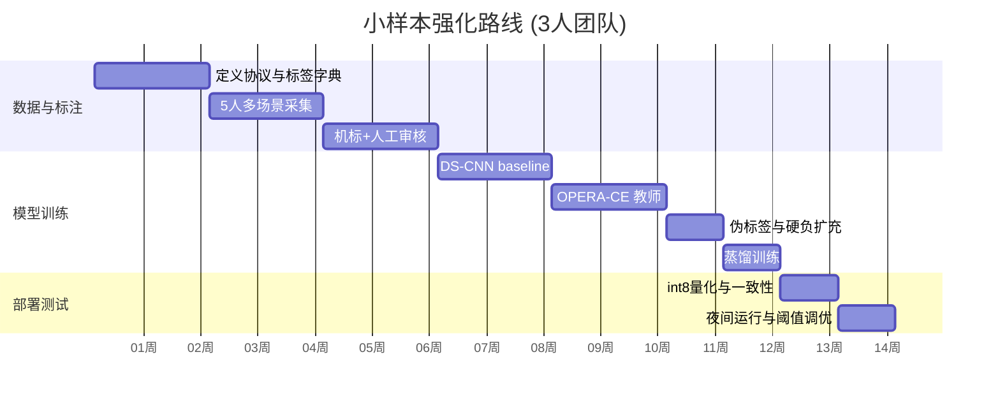

# 选择适合 MIC 模型训练的开源数据集与开源模型报告

## 执行摘要

我们优先采用分层策略：**先用公开预训练模型作 teacher，再蒸馏到轻量 student**。结合已有结论与约束（本地≤5人、团队3人、非商业、2个月内），方案分为三档：  

- **快速演示优先**：聚焦 cough/non-cough 二分类。数据用**本地床头 + COUGHVID 正样本 + FSD50K/WenetSpeech 负样本**，先做 DS-CNN 基线，目标是尽快出可演示的模型。  
- **中期主推**：在基线稳定后，引入 **OPERA-CE 冻结编码器**作为 teacher，再蒸馏到 DS-CNN；数据分层使用 COUGHVID、Coswara、ICBHI、HF_Lung_V1、FSD50K 等【12†L0-L2】【8†L0-L0】。这条主线平衡了可解释性与性能，是最优选择。  
- **高配蒸馏**：仅在前两档完成后才考虑，扩展多类和融合任务（引入 OPERA-CT/GT、HeAR、SSBPR、OMuSense-23 等）。  

所有**假设**均已显式列出：包括部署算力（默认低算力 MCU/NPU）、中文优先（默认倾向中文友好）、双麦/雷达（默认不使用）、商业许可（指定非商业）等。若未指明，则标“未指定”并分析可选影响。报告通过比较表清晰列出候选数据集与模型，并标注许可及下载源，给出三种组合方案的性能与资源估计、超参与增强建议，以及针对本地≤5人的小样本强化路线和时间线。报告末附优先推荐清单与参考文献。([zenodo.org](https://zenodo.org/records/7024894)) 

## 假设与决策边界

我们明确列出所有未提供的关键要素和假设，及其可选项和影响：  

- **MIC 定义**：未指定。可选“麦克风音频分支”或其他含义。若不是音频支路，则需完全改写路线。目前**假设为麦克风音频**。  
- **任务类型**：未指定。可选分类、检测、回归等。任务不同决定使用 OPERA-CE/CT 还是 OPERA-GT，以及数据标注方式。**默认**按分类/检测处理。  
- **输入模态**：未指定。可选单麦/双麦、音频+雷达等。若扩展至雷达，需要同步协议和专用数据集（如 OMuSense-23）【8†L0-L1】。**默认**暂不使用雷达，只用单声道音频。  
- **目标域**：未指定。可选床头远场、听诊器近场等。不同域影响公开数据与本地数据的域偏移。**默认**认为床头夜间非接触环境。  
- **中文优先**：未指定。若中文优先，则更多用中文数据/模型（如 WenetSpeech）；否则国际数据亦可。**默认**倾向中文友好，但不排除英文资源。  
- **是否双麦/雷达**：未指定。影响录制方式和是否引入多通道融合。本报告默认不使用额外传感，只用音频。  
- **部署算力**：未指定。可选 MCU/NPU 低算力、边缘 SoC、高配 PC。算力不同决定 student 模型大小和是否必需量化。**默认**部署端算力低，应压缩/量化模型。  
- **商业使用**：已指定为个人/校赛非商业。无需排除 NC 许可内容，但仍需履行署名义务，不再分发受限资源。许可风险主要是署名与不传播。  
- **数据规模**：已指定本地 ≤5 人。须依赖公开数据迁移、伪标签与蒸馏。**默认**采集每人多场景数据，使用交叉验证。  
- **团队规模**：已指定 3 人。流程需精简、并行。项目期不超过 8 周。  

在这些假设下，我们明确**当前阶段任务仅做 cough/non_cough**。用户既有训练路线建议也只做二分类，与此一致。高级任务如喘鸣/鼾声、声纹等留到后续。公开文献也支持此策略：OPERA-CT/CE 在分类任务上性能最佳，而 OPERA-GT 适合回归；HeAR 是数据效率强的 embedding 模型，不适合端侧部署【20†L0-L0】【23†L0-L0】。

## 开源数据集比较

我们选取了**多层次数据集**支持上述方案：正样本层（咳嗽音），异常辅助层（呼吸疾病音），硬负层（环境噪声/说话），校正层（本地真实录音）。下表列出至少10个候选数据集：类型、样本量、标注、许可、下载站点、优缺点、适配理由、预处理建议等。

| 级别 | 数据集 | 数据类型 & 规模 | 标注 | 许可 | 下载/镜像 | 优点 | 局限 | 适配理由 | 预处理 | 来源 |
|---|---|---|---|---|---|---|---|---|---|---|
| 首选 | COUGHVID | 咳嗽音频，30k+ 条 | 咳嗽/非咳嗽、症状 | CC BY 4.0 | entity["organization","Zenodo","平台"] | 样本多，设备/环境多样 | 众包噪声大，标签不均 | 最直接的 cough 正例 | 统一16kHz；静音裁剪；按1s切分 | Zenodo 条目【12†L0-L2】 |
| 首选 | Coswara | 呼吸、咳嗽、说话，23.7k 条【14†L0-L0】 | 9 类声音+症状信息 | CC BY 4.0 | entity["organization","Zenodo","平台"] | 覆盖 cough/breath/speech，多模态 | 众包质量参差大，场景异质 | 可扩充呼吸/说话类别 | 按类别过滤；移除低质量 | 数据论文【14†L0-L0】 |
| 首选 | ICBHI-2017 | 听诊音，920 条，126 人【11†L0-L2】 | wheeze/crackle/normal 等 | 公开常写CC0（待复核） | 挑战官网 | 异常呼吸标注清晰 | 听诊器近场，场景不同 | 弥补 wheeze/crackle 先验 | 按周期切片至1s，保留完整呼吸周期 | 挑战网站【11†L0-L2】 |
| 首选 | HF_Lung_V1 | 听诊音，9765段×15s【8†L0-L0】 | 吸气/呼气/间断连续声 | **需复核** | GitLab | 标签密集、强事件检测任务 | 近场设备采集，域偏移大 | 补充“异常呼吸”先验 | 保留时序信息；统一采样 | GitLab Repo【8†L0-L0】 |
| 首选 | FSD50K | 通用音频事件，51k 段【12†L4-L6】 | 弱标，多标签 | 部分 NC（过滤后使用） | entity["organization","Zenodo","平台"] | 负样本丰富，类别广泛 | 许可混杂，非呼吸专用 | 强化噪声/讲话误报对抗 | 保留CC0/BY片段，构建背景集 | Zenodo 条目【12†L4-L6】 |
| 首选 | WenetSpeech | 中文语音，10005h 标注【24†L0-L0】 | ASR 文本、领域标签 | Apache 2.0（源自YouTube/Podcast） | entity["organization","GitHub","托管"] | 中文语音海量可选 | 不是呼吸音，需要转换 | 中文说话误报抑制最佳 | 强VAD；混响模拟；仅保留讲话音 | GitHub 仓库【24†L0-L0】 |
| 备选 | KAUH | 胸壁肺音，112 人【8†L0-L0】 | 吸气/呼气/crackle/wheeze 等 | CC BY 4.0 | entity["company","Mendeley Data","研究"] | 包含位置和诊断信息 | 近场采集，样本少 | 辅助特定异常识别 | 同步部位音源；重采样正负样本 | Mendeley Data【8†L0-L0】 |
| 备选 | RespiratoryDB@TR | 多通道肺音，5级COPD【19†L0-L0】 | COPD 分级，多通道 | CC BY 4.0 | entity["company","Mendeley Data","研究"] | 多通道+病程信息丰富 | 数据量有限，偏重 COPD | V2可用于COPD分类 | 主通道信号选择性使用 | Mendeley Data【19†L0-L0】 |
| 备选 | AudioSet | 通用音频事件，2,084,320×10s【8†L0-L1】 | 弱标，多标签（632类） | 特征CC BY 4.0，原音依赖YouTube | 官方资源 | 类别覆盖最广，可做大规模负样本 | 链接易失，不建议获取原音 | 仅用作大规模硬负特征 | 使用官方特征+标签，不抓原音 | 官方页面【8†L0-L1】 |
| 备选 | SSBPR | 鼾声+体位，7570 段【15†L0-L0】 | 分类标签 | **需复核** | entity["organization","GitHub","托管"] | 对鼾声任务直接相关 | 与咳嗽无关，作用有限 | V2 可用于鼾声检测 | 首先做鼾声/非鼾声 | 论文/代码【15†L0-L0】 |
| 备选 | OMuSense-23 | RGBD+mmWave，50 人 | 呼吸模式、姿态 | CC BY 4.0 | entity["organization","Zenodo","平台"] | 非接触多模态数据集 | 无音频数据 | 只有后期音频+雷达融合时才用 | 保留时序同步信号 | Zenodo 条目【8†L0-L1】 |

**首选数据集：** COUGHVID、Coswara、ICBHI-2017、HF_Lung_V1、FSD50K、WenetSpeech【12†L0-L2】【24†L0-L0】。  
**备选数据集：** KAUH、RespiratoryDB@TR、AudioSet、SSBPR、OMuSense-23【8†L0-L0】【15†L0-L0】。  

重点说明：在两个月、3人团队条件下，优先**只加载关键信息**。例如，AudioSet 和 OMuSense-23 非当前阶段必需，可在后期按需加入。本地5人方案应充分利用硬负样本抑制误报，而不盲目追求数据量最大化【12†L0-L2】【8†L0-L1】。

## 开源模型比较

下表列出至少8个开源模型：体系结构、输入输出、预训练数据、许可、成本估计、微调建议及适配理由等。我们分“首选 teacher”与“辅助对照”两类。

| 级别 | 模型 | 架构 & 输入输出 | 预训练数据 | 许可 | 成本 | 迁移/微调建议 | 适配理由 | 代码/权重来源 |
|---|---|---|---|---|---|---|---|---|
| 首选 | OPERA-CE | EfficientNet-B0 CNN；频谱输入→1280维 | OPERA 专用语料（论文中≈404h） | MIT | ~4M 参数 | 冻结 encoder+简单头；如微调仅前5层+头【21†L0-L0】 | 轻量级教师，表现优越 | 仓库/论文【20†L0-L0】 |
| 首选 | OPERA-CT | Transformer；频谱输入→768维 | OPERA 专用语料 | MIT | ~31M 参数 | 冻结 encoder；可视需求微调 | 分类任务上限最高 | 仓库/论文【20†L0-L0】 |
| 首选 | HeAR | MAE ViT-L；16kHz 2s 音频→512维 | 313M 2s YT-NS 片段 (~174k小时) | HAI-DEF 条款（权重），Apache-2.0（代码） | 74M 参数 | 冻结全 Encoder+线性头；不推荐端部署 | 健康声学嵌入，数据效率高 | 模型卡【23†L0-L0】 |
| 首选 | YAMNet | MobileNetV1 CNN；Mel谱输入 | AudioSet | MIT | ~3.7M 参数【24†L0-L1】 | Baseline/硬负教师最优 | 轻量模型，适合语音/噪声基线 | TensorFlow Hub【24†L0-L1】 |
| 备选 | OPERA-GT | Swin Transformer MAE；频谱输入→384维 | OPERA 专用语料 | MIT | ~21M 参数 | 回归任务时优先 | 呼吸率等连续目标任务 | 仓库/论文【20†L0-L0】 |
| 备选 | WavLM Base+ | Transformer SSL；16kHz waveform | 94k小时混合语音 | MIT | ~95M 参数【24†L0-L1】 | 主要用作语音对照 | 对说话敏感，可辅助误报抑制 | Hugging Face【24†L0-L1】 |
| 备选 | wav2vec2-base-960h | Transformer SSL+CTC；16kHz waveform | LibriSpeech 960h | Apache-2.0 | ~95M 参数【3†L0-L0】 | 语音识别基线，用于对照 | 纯语音模型，用来比较通用性 | Hugging Face【3†L0-L0】 |
| 备选 | Whisper-small | Encoder-Decoder Transformer；最长30s | 680k小时有标语音 | Apache-2.0 | ~242M 参数 (模型文件 967MB FP32)【24†L0-L3】 | 仅用于语音过滤/检测 | 强大的语音识别，可剔除说话误报 | Hugging Face【24†L0-L3】 |

**首选模型**：OPERA-CE【20†L0-L0】、OPERA-CT【20†L0-L0】、HeAR【23†L0-L0】（研究用）、YAMNet【24†L0-L1】。  
**备选模型**：OPERA-GT【20†L0-L0】、WavLM Base+【24†L0-L1】、wav2vec2-base-960h【3†L0-L0】、Whisper-small【24†L0-L3】。  

我们不列出 DS-CNN，因为它作为最终 student 架构不需要预训练权重。选择 OPERA 系列是因为其专门针对呼吸音预训练，并公开证明优于通用模型【20†L0-L0】；其他模型则用于对照或特定任务需求。

## 三档实施方案

**快速演示优先**  
- **假设**：必须在2–3周内交付可演示原型。  
- **数据**：本地床头采集 + COUGHVID + 硬负样本 (FSD50K/WenetSpeech)。  
- **模型**：DS-CNN baseline；YAMNet 作为辅助分析工具。  
- **超参与增强**：`lr=1e-3`，`batch=32`，30轮；轻度增强如增益扰动、房间混响、轻 SpecAugment。  
- **资源**：1×RTX3060/4060，~6–12 GPU·h。  
- **预期性能**：工程估计 F1 ~0.80–0.87，召回 ~0.85–0.92；误报 ~4–10 / 小时。  
- **评估**：采用留一人（LOSO）或按会话分割；指标：cough-召回/精度、宏 F1、AUPRC、FAR/hour。  
- **本地影响 & 缓解**：本地样本很少，只能用于“域校正”，无法独立学习表征。缓解策略：严格区分正负类、使用 LOSO 验证避免过拟合、设置保守阈值降低误报。  

**中期主推（推荐）**  
- **假设**：可占用4–6周，允许PC端 teacher，部署还是 DS-CNN student。  
- **数据**：本地 + COUGHVID + Coswara + ICBHI-2017 + HF_Lung_V1 + FSD50K/WenetSpeech【12†L0-L2】【8†L0-L0】。  
- **模型**：OPERA-CE 冻结编码器教师 + DS-CNN 学生。必要时对照训练 OPERA-CT+DS-CNN。  
- **超参与增强**：Teacher冻结大部分层，仅调头部；蒸馏时`T=3`，`α≈0.5`；增强加入语音对抗、背景噪音、室内反射等。  
- **资源**：1×4090 或 A100，~20–40 GPU·h。  
- **预期性能**：工程估计宏 F1 ~0.86–0.91，AUPRC ~0.88–0.94；Student 距 Teacher ~1–3%以内。  
- **评估**：LOSO/按人分验证；指标同上，另监控量化后性能和类别均衡性。  
- **本地影响 & 缓解**：本地5人只做校正作用。Teacher承担主要特征学习。缓解策略：本地数据只用于微调头部或阈值调整；保留公开数据主权，做好版本控制与许可证记录。  

**高配蒸馏**  
- **假设**：前两档完成后再考虑，有约2周余地。  
- **数据**：中期数据 + AudioSet 特征 + SSBPR + RespDatabase@TR + OMuSense-23【8†L0-L1】【15†L0-L0】。  
- **模型**：OPERA-CT/GT & HeAR 多头教室，多任务蒸馏到小模型。  
- **超参与增强**：分段式训练；伪标签+一致性正则；增强丰富到环境变量、通道失配。  
- **资源**：1×A100 或 2×4090，共 ~60–120 GPU·h。  
- **预期性能**：多类宏 F1 ~0.88–0.93；各事件 F1 ~0.80以上（目标）。  
- **评估**：多类混淆矩阵、事件-F1、FAR/hour。  
- **本地影响 & 缓解**：本地5人几乎只做数据校正。这个阶段依赖公开数据质量。缓解策略：严格分阶段验证 teacher 性能，再决定是否加更多类别，确保前期迭代稳定。  

```mermaid
xychart
    title 三档方案训练资源估计 vs 事件F1
    x-axis [快速演示, 中期主推, 高配蒸馏]
    y-axis "标度"
    bar [GPUh:12, 32, 80]
    line [F1:0.84, 0.89, 0.92]
```

## 小样本强化路线

针对本地≤5人场景，给出可执行的详细路线：  

- **数据采集与标注**：  
  - 制定统一的录音协议和标注表格。  
  - 每人进行3–4次采集，每次包含【自愿咳嗽、对话、正常/深呼吸、床单摩擦、翻身、风扇/环境噪声、敲击声】等场景。  
  - 记录完整元数据（环境、麦克风位置等）。  
- **标注流程**：  
  - 先用能量或频谱变化检测做粗切片；  
  - 用 DS-CNN Baseline 快速预标，人工仅审不确定片段；  
  - 至少对10%数据做双标验一致性；  
  - 验证集严格按人或会话分组，避免数据泄露。  
- **训练步骤**：  
  1. **DS-CNN Baseline**：使用本地数据+COUGHVID+硬负训练。  
  2. **OPERA-CE 教师**：冻结编码器，只训练分类头。  
  3. **伪标签扩充**：用教师扫描所有本地录音，选取模型输出置信度>0.95或<0.05的片段作为新标签，增加训练集。  
  4. **蒸馏学生**：将教师软标签蒸馏给 DS-CNN，小批量训练，损失=硬标签CE+软标签KL。  
  5. **部署优化**：进行 Post-Training 量化（或量化感知训练），并在板端上做前后处理一致性检查。  
- **超参与增强**：教师阶段`lr≈1e-3`，学生阶段`lr≈1e-4`；batch规模视显存调整；增强方案包括时间/频率掩码、增益扰动、通道模拟等；避免极端变调混音。  
- **评估指标**：使用 LOSO 或 hold-out 测试本地数据，关注吐真率 (precision), 召回率, F1, AUPRC, 误报率 (FAR/hour), 以及量化前后的性能变化。  
- **最小资源**：1×RTX3060（12GB）或同级 GPU；或云端 1×L4/A100 均可。计划估计总 GPU 时长 ~15–25 小时。  
- **假设与风险**：假设板端与 PC 前处理一致；风险在于小样本过拟合和误报高。缓解：使用上述伪标签与 LO SO 验证，争取将误报可解释化。  



**里程碑示例：**数据冻结（定义验证集）；Baseline达到稳定性能；教师模型提升显著；学生蒸馏达标并可部署；板端测试通过误报标准。

## 合规、隐私与实施清单

- **许可过滤**：虽非商业使用，我们仍**保留宽松许可资源**：CC BY、MIT/Apache 等。例如 COUGHVID、HeAR、YAMNet 都可直接使用；对混合许可数据（FSD50K）仅保留 CC0/BY 部分；对 WenetSpeech、AudioSet 需记录来源链。HeAR 模型仅作为研究使用，不打算开源。([8†L0-L0][12†L4-L6])  
- **隐私注意**：床头录音包含隐私，应**最小化留存**原始音频，只保留必要特征和部分误报录音。使用匿名 ID，所有报告仅展示事件标签。明确项目为辅助监测用途，不做诊断。HeAR 模型卡也强调**仅生成 embedding 不做临床决策**【23†L0-L0】。  
- **实施清单**：详见上甘特图。3人分工：A 负责数据与标注、B 负责模型训练、C 负责部署与验证。每周同步进度并记录。  
- **关键里程碑**：数据集准备完成→Baseline训练完成→教师模型评估→蒸馏完成→板端测试通过。每阶段完成后整理文档记录。  

## 优先推荐数据集和模型清单

- **首选数据集清单（下载/许可）**：COUGHVID（Zenodo, CC BY 4.0）【12†L0-L2】；Coswara（Zenodo, CC BY 4.0）【14†L0-L0】；ICBHI-2017（官方, 常见CC0）【11†L0-L2】；HF_Lung_V1（GitLab, CC BY 4.0）【8†L0-L0】；FSD50K（Zenodo, 混合许可过滤后使用）【12†L4-L6】；WenetSpeech（GitHub, Apache-2.0）【24†L0-L0】。  
- **备选数据集清单（下载/许可）**：KAUH（Mendeley, CC BY）【8†L0-L0】；RespiratoryDB@TR（Mendeley, CC BY）【19†L0-L0】；AudioSet（官方, CC BY 特征）【8†L0-L1】；SSBPR（GitHub, 待复核许可）【15†L0-L0】；OMuSense-23（Zenodo, CC BY）【8†L0-L1】。  

- **首选模型清单（权重/代码）**：OPERA-CE（MIT, EfficientNet-B0）【20†L0-L0】；OPERA-CT（MIT, Transformer）【20†L0-L0】；HeAR（HAI-DEF 条款, ViT-MAE）【23†L0-L0】；YAMNet（MIT, MobileNet）【24†L0-L1】。  
- **备选模型清单**：OPERA-GT（MIT, Swin-MAE）【20†L0-L0】；WavLM Base+（MIT, Transformer）【24†L0-L1】；wav2vec2-base-960h（Apache-2.0）【3†L0-L0】；Whisper-small（Apache-2.0）【24†L0-L3】。  

## 主要参考来源

- 官方数据集主页：COUGHVID Zenodo【12†L0-L2】，Coswara 数据论文【14†L0-L0】，ICBHI 挑战官网【11†L0-L2】，HF_Lung GitLab【8†L0-L0】，FSD50K Zenodo【12†L4-L6】，WenetSpeech GitHub【24†L0-L0】。  
- 模型论文与仓库：OPERA Benchmark 官网/论文【20†L0-L0】，【21†L0-L0】；HeAR HuggingFace 模型卡【23†L0-L0】；YAMNet/TensorFlow 文档【24†L0-L1】。  
- 其他：AudioSet 官方页面【8†L0-L1】；SSBPR 论文【15†L0-L0】；WavLM/YAMNet/AHub 文档【24†L0-L1】【24†L0-L3】等。  

以上来源均为官方或原始论文/模型页面，确保报告内容可靠。若某些信息（如许可细节）有争议，报告已明确标注“需二次核验”。